# SwiftShop
- The goal of this project is to recreate a full stack Amazon-esque e-commerce website. Potentially adding in an admin dashboard as well. The strategy will be to make the front end using React first, since this will take the longest to hammer out. Then create the backend utilizing Node.js and MongoDB Atlas. My goal is to make an app with the least amount of extra fluff, but still enough new tech to help move my project along quickly. I will try and explain every package I install for this project and the reason why, as I install them. 

# Mockups
https://www.figma.com/file/xyr0O8AXE4CA1b17AYjMMp/Untitled?node-id=1%3A310&t=JDPGdAG7IzjMUIAm-1

 - Note: These are initial mockups for the site and are subject to change. 

### Initial Mockup of Home Page
 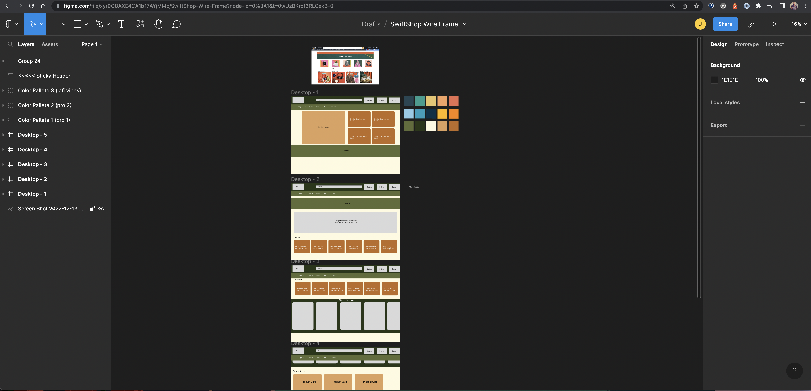
 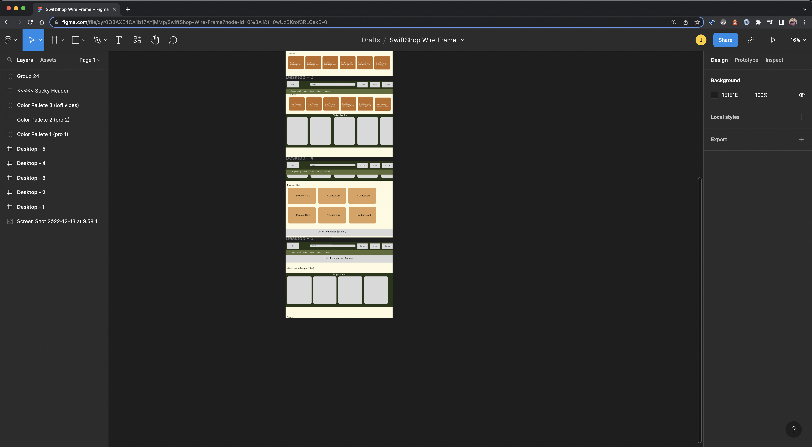
### Color Palletes
 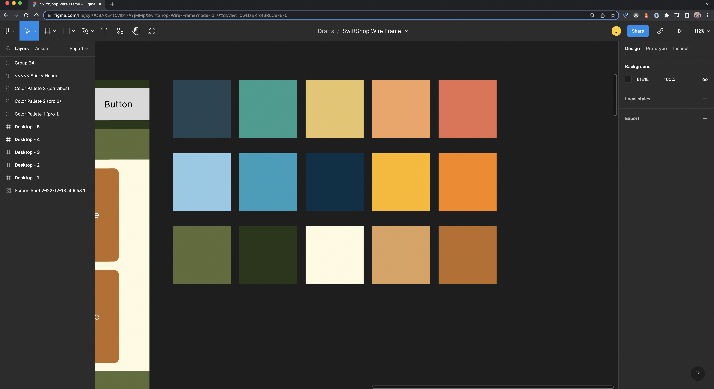
### Home Page
 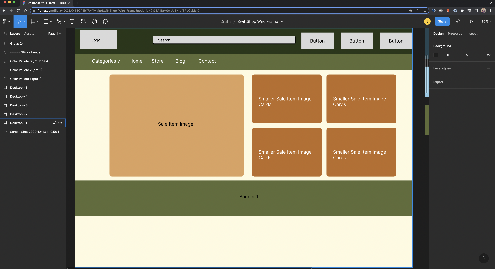
 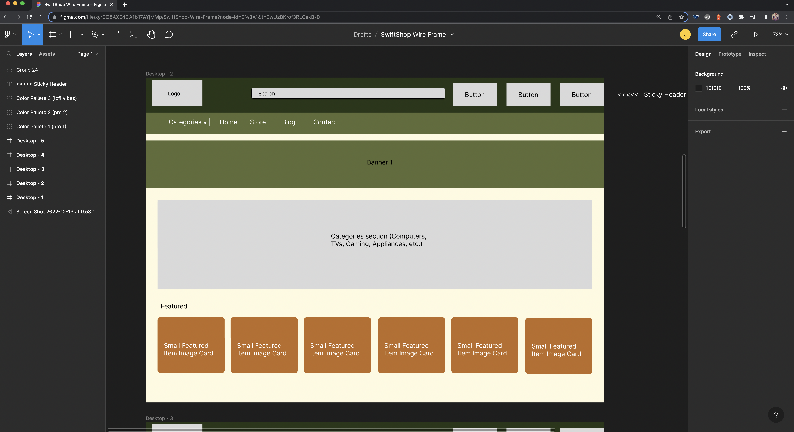
 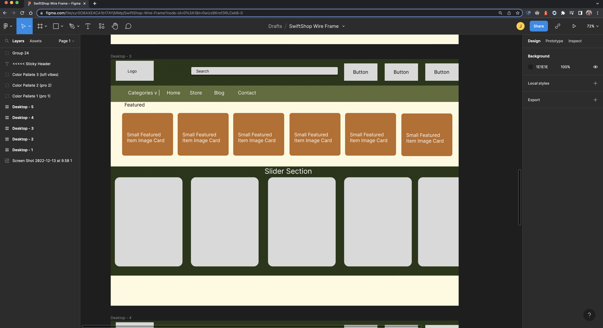
 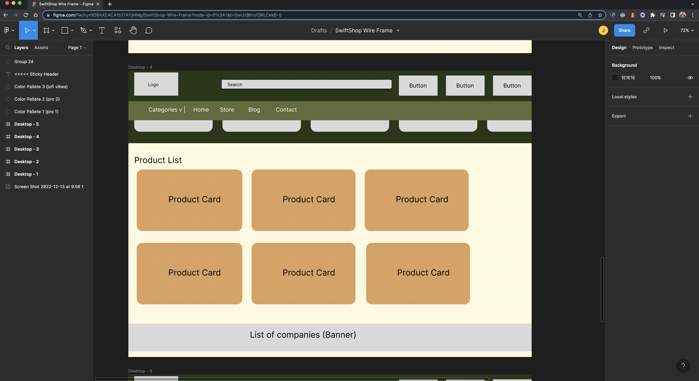
 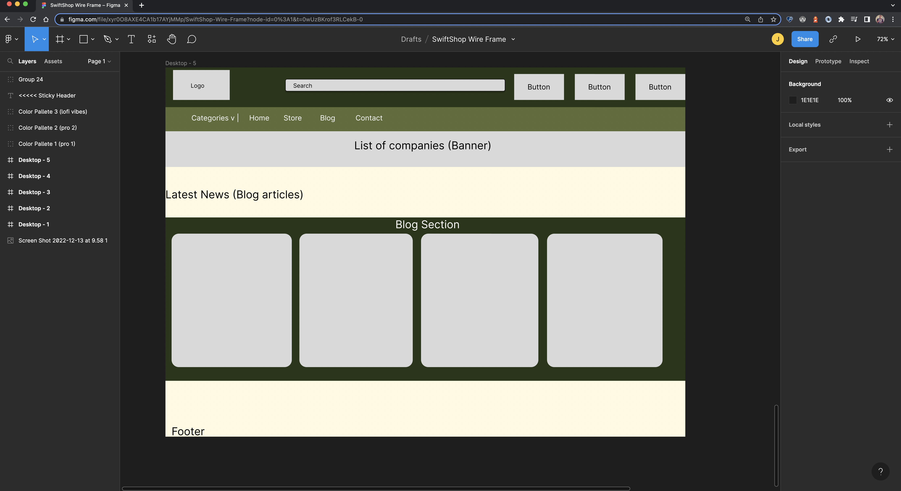
### Store Page
 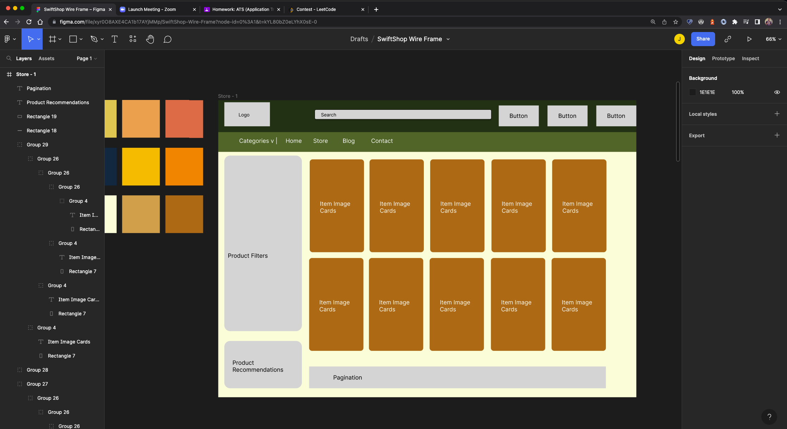
### Blog
 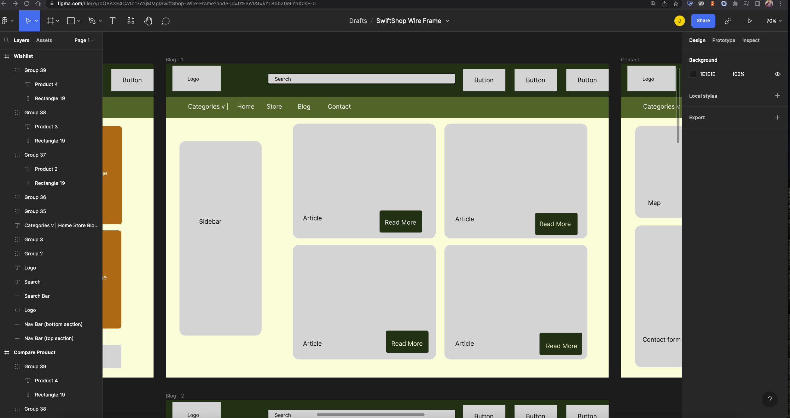
 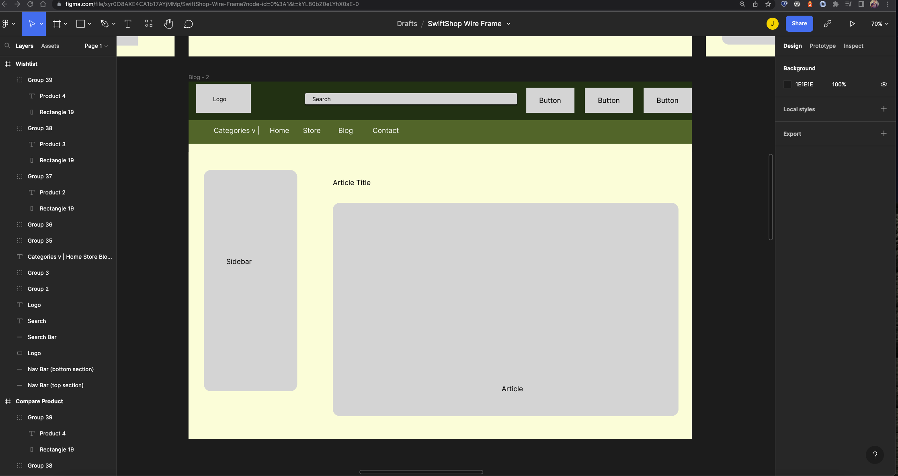
### Compare Items Page
 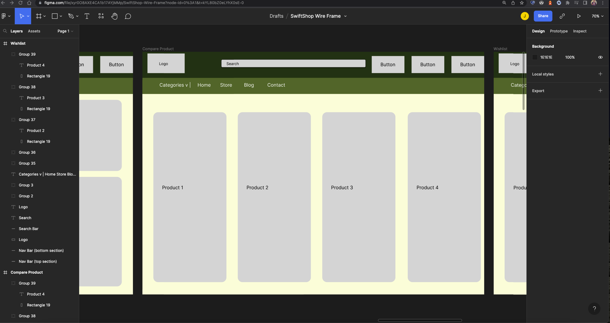
### Wishlist
 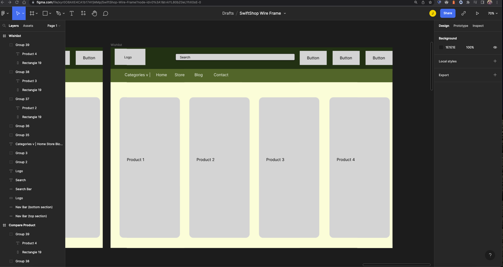
### Contact Us
 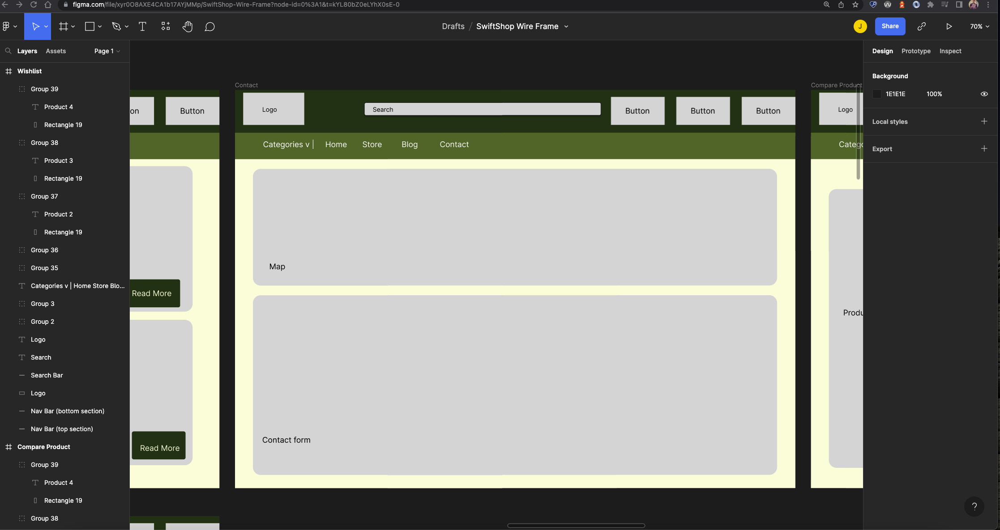

# Steps to create front end
   Run these commands: 
    - npx create-react-app swiftshop --template redux
    - npm i react-icons react-router-dom react-fast-marquee react-rating-stars-component react-helmet react-image-zoom
## What Are These Packages For? 
  1. React Icons is a library of icons that I can use for my app
    - https://react-icons.github.io/react-icons/

  2. React Router Dom is needed because this is not a SPA, I'm anticipating there will be multiple pages and routes in this app, at least 4. It is a package that allows you to implement dynamic routing in your app, it's equipped with client and server-side routing. It's basically essential, I'll mainly be using Router, Route, and Link.
    - https://github.com/remix-run/react-router/blob/main/docs/start/tutorial.md

  3. React Fast Marquee is a quick way to throw anything in a marquee and have it look good and responsive in like 10 minutes. I saw a lot of these when I was e-commerce website hunting, so I wanted to find a quick way to do it without CSS translate/tranform magic.
    - https://www.react-fast-marquee.com/

  4. React Rating Stars are just that, little premade rating stars that you can add to any site to make it look and feel more official and interactive. Didn't have a ton of time to write logic for them so I utilized this library. There is a nice rating component in Material UI but I wanted to stay away from MUI as I did basically my whole last project using MUI. 
    - https://www.npmjs.com/package/react-rating-stars-component

  5. React Helmet is pretty common in React apps with lots of pages as well, I'm using it because I want different titles in the head component of the app whenever the user moves pages. React-helmet overrides the index/site-level description meta tag and renders the lower-level one, so you can also change meta tags in each page if you're trying to level up your SEO.
    - https://www.npmjs.com/package/react-helmet
  
  6. React image zoom is a very helpful package that allows image zooming on hover. I'll be using this to add some flair to the product page, zooming in on a product is a basically a staple on e-commerce websites, so this package is how I'll be implementing that functionality. 
    - http://malaman.github.io/react-image-zoom/example/index.html

# Steps to create back end
  Run these commands: 
  - npm init -y
  - mkdir config controller middleware models routes
  - touch index.js
  - npm i express mongoose bcrypt body-parser dotenv
## Dev Notes
### Bugs To Fix
  1. On the login, signup, and forgot password page there is a horizontal scroll wheel. Double check CSS here. 
  2. Broken images literally everywhere...